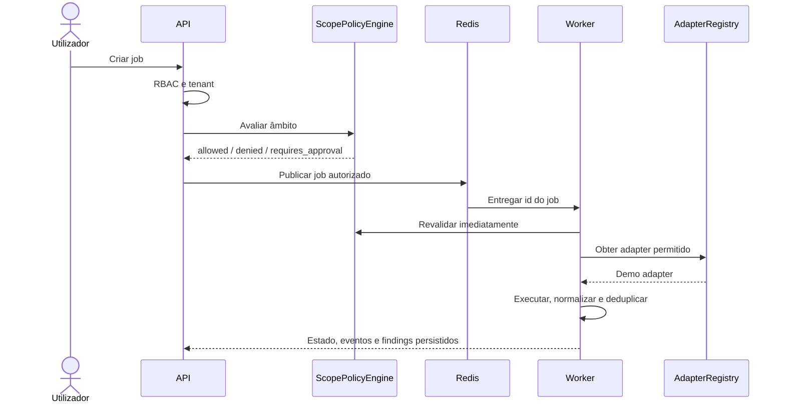

# Orquestração de jobs

O `JobOrchestrator` é a única camada autorizada a publicar jobs na fila Dramatiq/Redis.

A máquina de estados explícita rejeita transições arbitrárias. Cada transição produz `JobEvent` e, quando existe ator humano, `AuditLog`. O progresso é monotónico.

O endpoint SSE transmite apenas estado, progresso e mensagem do job do tenant autenticado. O frontend usa polling autenticado como fallback.
