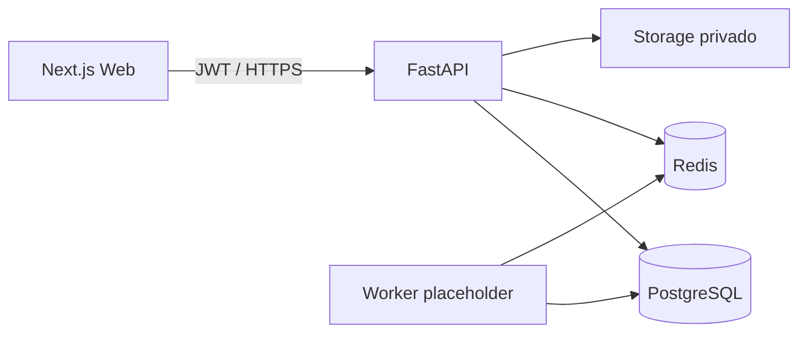

# Arquitetura

CyberAudit é um monorepo com frontend Next.js, API FastAPI, worker placeholder e pacotes partilhados. A API é a fronteira de confiança: deriva o tenant do JWT, aplica RBAC, filtra queries empresariais por `organization_id` e regista mutações.

O worker não executa scanners na Fase 1. Adaptadores futuros terão de chamar o `ScopePolicyEngine` antes de preparar ou executar qualquer job.
