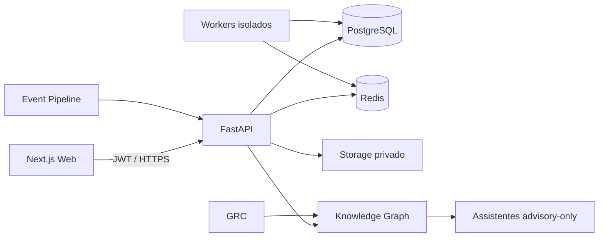

# Arquitetura

## Enterprise domain expansion

Migration `0009` extends the existing Enterprise core with read-only connectors
and normalized Identity, SaaS, Cloud, Kubernetes, runtime, endpoint, mobile and
Zero Trust domains. The API remains the only public boundary. Connector syncs
are queued in Redis and the worker reloads tenant and connector state before
processing.

Provider objects project into the existing Knowledge Graph, Risk, Attack Graph,
Data Lake, SOC, GRC and advisory AI boundaries. Projections are incremental,
idempotent and bounded; no endpoint loads an entire graph into memory.

CyberAudit é um monorepo com frontend Next.js, API FastAPI, worker placeholder e pacotes partilhados. A API é a fronteira de confiança: deriva o tenant do JWT, aplica RBAC, filtra queries empresariais por `organization_id` e regista mutações.

O worker de avaliações volta a executar o `ScopePolicyEngine` antes de cada
adaptador. Workers enterprise recebem apenas IDs e processam deteções e projeções
internas, sem rede ou execução de código submetido. PostgreSQL é a fonte de
verdade para Asset Graph, SOC, GRC e Knowledge Graph.

Consulte os ADRs e os documentos `soc-detection-response.md`,
`grc-platform.md` e `knowledge-graph-ai.md`.
