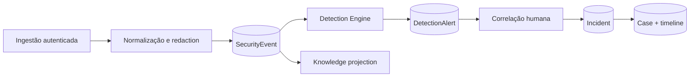

# SOC, Detection & Incident Response

## Fluxo

O pipeline aceita apenas campos declarados e operadores `equals`, `contains`,
`gte` e `in`. Nunca avalia expressões, código ou queries livres. Eventos são
deduplicados por origem/ID e deteções por fingerprint estável.

Incidentes seguem `open → triaged → investigating → contained → resolved →
closed`; saltos são rejeitados e cada alteração é auditada. Timeline entries
são append-only por contrato da aplicação.

Threat hunting pesquisa campos allowlist sobre eventos internos. Playbooks
aceitam apenas checklist, notify, assign, request_approval e document;
`automatic_execution` permanece falso.

O Security Data Lake guarda metadados de objetos privados, hashes, classificação
e retenção. Conteúdo não é interpretado nem servido publicamente.

MITRE ATT&CK é representado por identificadores associados a regras, alertas e
exercícios purple-team simulados. CyberAudit não inclui conteúdo licenciado nem
executa técnicas ATT&CK.
